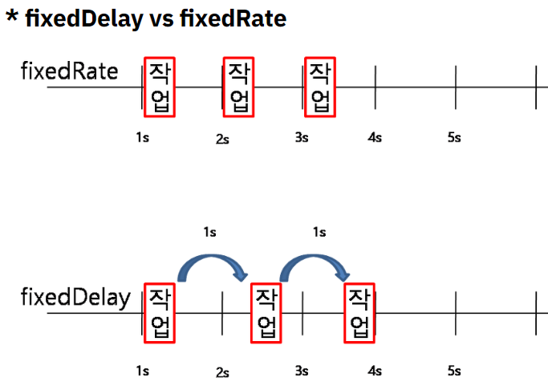

# @Scheduled

[목록으로 돌아가기](../../README.md)

## 개요

`@Scheduled`는 특정 메서드를 정해진 시간에 반복해서 실행할 수 있게 만드는 어노테이션이다.

주로 주기적으로 어떤 작업을 시행할 때 사용한다.

ex) 1시간마다 새로 고침, 등

## 속성 (Attribute)

* ### cron

(`초` `분` `시` `일` `월` `주` `(년)`)의 형태로 된 문자열이다.

```Java
// 매일 새벽 1시에 이 함수를 시행한다.
@Scheduled(cron = "0 0 1 ** *")
public void updatePrice() {}
```

위와 같은 형태로 사용한다.

* ### fixedDelay

milliseconds 단위로, 이전 작업이 끝난 시점으로 부터 고정된 시간을 설정한다.

```Java
// 이전 작업이 끝나고 5초 뒤에 메서드를 호출한다.
@Scheduled(fixedDelay = 5000)
private void updatePrice(){}
```

fixedDelayString을 사용할 경우 값을 문자열로 받을 수 있다.

```Java
@Scheduled(fixedDelayString = "5000")
private void updatePrice(){}
```

* ### fixedRate

milliseconds 단위로, 이전 작업이 수행되기 시작한 시점으로 부터 고정된 시간을 설정한다.

```Java
// 이전 작업이 시작하고 5초 뒤에 메서드를 호출한다.
@Scheduled(fixedRate = 5000)
private void updatePrice(){}
```

마찬가지로 fixedRateSting도 존재한다.

* ### fixedDelay vs fixedRate

fixedDelay는 호출한 메서드의 작업이 끝난 뒤부터 시간을 재지만, fixedRate는 호출한 메서드와 무관하게 일정 시간마다 호출을 반복한다.


